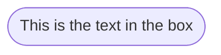
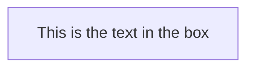
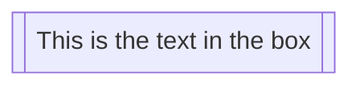
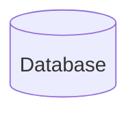
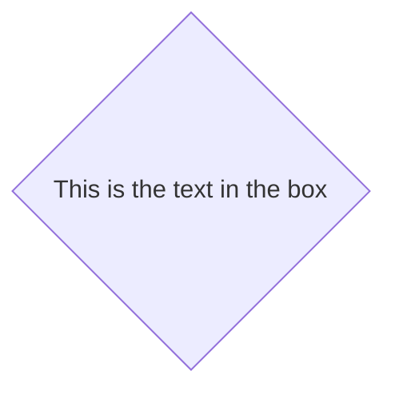
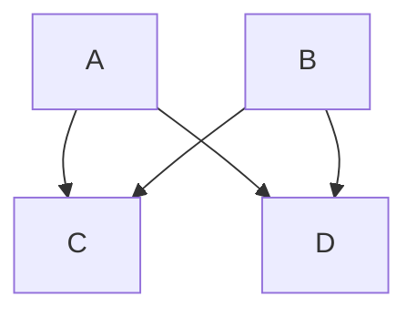
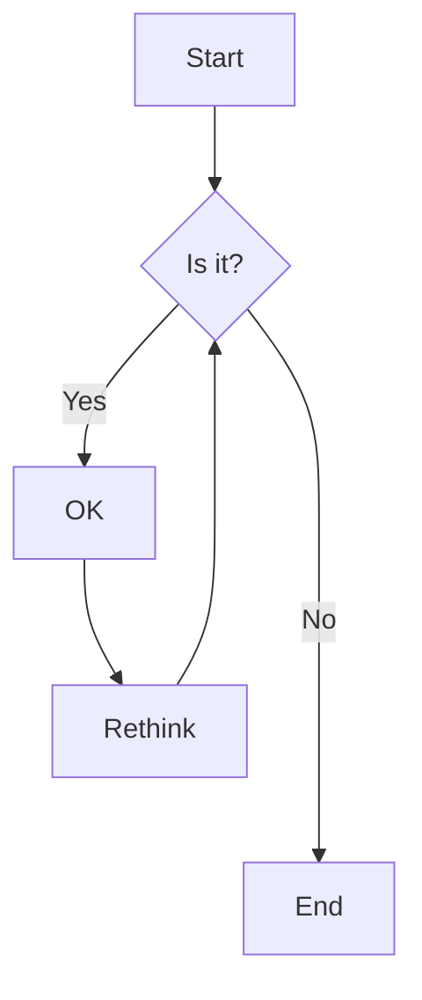
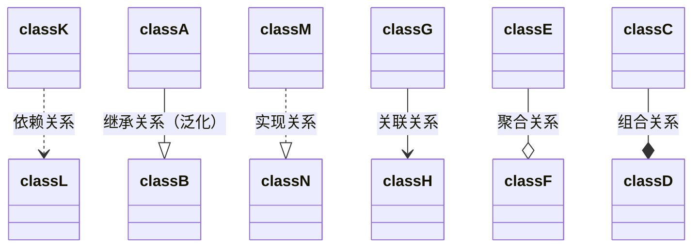
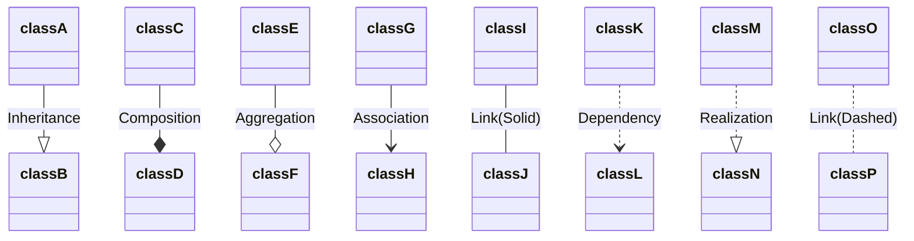
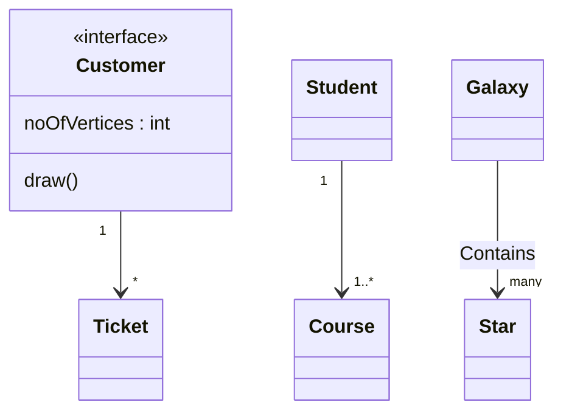

## 流程图

**常用图形：**

* 开始/结束

```
flowchart LR 
id1([This is the text in the box])
```



* 流程

```
flowchart LR
id1[This is the text in the box]
```



* 子流程

```
flowchart LR
    id1[[This is the text in the box]]
```



* 数据库

```
flowchart LR
    id1[(Database)]

```



* 判定

```
flowchart LR
    id1{This is the text in the box}
```



**流程图展示位置：**

- TB - top to bottom
- TD - top-down/ same as top to bottom
- BT - bottom to top
- RL - right to left
- LR - left to right


**多指向型流程：**

```
flowchart TB
    A & B--> C & D
```



**举例：**

```
flowchart TD
    A[Start] --> B{Is it?};
    B -- Yes --> C[OK];
    C --> D[Rethink];
    D --> B;
    B -- No ----> E[End];
```



**具有超链及其提示语的流程图(仅仅可在前端进行使用)：**

```html
<!DOCTYPE html>
<html lang="en">
<head>
    <meta charset="UTF-8">
    <meta http-equiv="X-UA-Compatible" content="IE=edge">
    <meta name="viewport" content="width=device-width, initial-scale=1.0">
    <script src="https://cdn.jsdelivr.net/npm/mermaid/dist/mermaid.min.js"></script>
    <title>Document</title>
</head>

<body>
    <div class="mermaid">
      flowchart LR;
          A-->B;
          B-->C;
          C-->D;
          click A callback "Tooltip"                                   //双引号内部为提示语 href为跳转URL
          click B "http://www.github.com" "This is a link"
          click C call callback() "Tooltip"
          click D href "http://www.github.com" "This is a link"
    </div>
  
    <script>
      var callback = function(){
          alert('A callback was triggered');
      }
      var config = {
          startOnLoad:true,
          flowchart:{
              useMaxWidth:true,
              htmlLabels:true,
              curve:'cardinal',
          },
          securityLevel:'loose',         //可以调用JS方法
      };
  
      mermaid.initialize(config);
    </script>
  </body>
</html>
    
```


## UML类图

**常用关系：**



```
classDiagram
classA --|> classB : Inheritance
classC --* classD : Composition
classE --o classF : Aggregation
classG --> classH : Association
classI -- classJ : Link(Solid)
classK ..> classL : Dependency
classM ..|> classN : Realization
classO .. classP : Link(Dashed)
```



**关系性质：**

```
The different cardinality options are :

1 Only 1
0..1 Zero or One
1..* One or more
* Many
n n {where n>1}
0..n zero to n {where n>1}
1..n one to n {where n>1}
```

**例子：**

```
classDiagram 
    Customer "1" --> "*" Ticket
    Student "1" --> "1..*" Course
    Galaxy --> "many" Star : Contains
    class Customer{  //定义类特征
    <<interface>>    //接口
    noOfVertices : int  //属性
    draw()  			//方法
```



